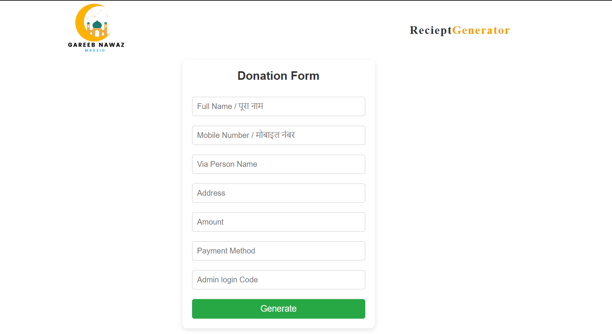
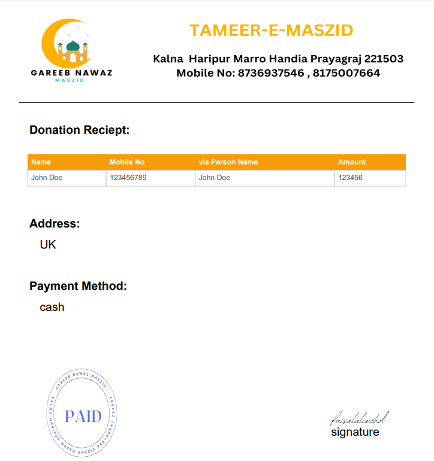

# Receipt Generator for Masjid Donations

I developed a custom **Receipt Generator** application for my masjid to solve a common issue: **difficulty in generating and sharing digital donation receipts**. Previously, the masjid staff relied on manual, paper-based receipts or struggled with sharing receipts digitally in a professional format. This often led to delays, disorganization, and inconvenience for both the masjid and donors.

To address this, I built a simple but powerful tool that generates professional **PDF receipts** instantly, making it easy to **print or share via email, WhatsApp, or other digital platforms**.

---

## Purpose

The main purpose of this project is to:

- **Eliminate manual receipt writing**, which was time-consuming and prone to errors.
- **Provide donors with immediate digital acknowledgment** of their contributions.
- Help the masjid **maintain accurate and well-organized donation records**.
- **Facilitate easy sharing of PDF receipts** through digital channels such as email and messaging apps.

---

## Key Features

- Automatic PDF generation
- Customizable templates with masjid branding (logo, contact info)
- Secure and organized data handling
- User-friendly interface for quick receipt creation
- Easy download and share options for digital delivery

---

## Screenshots

Here are some screenshots of the Receipt Generator in action:

### 1. Donation Form
_A simple and clean form where users can input donor details and donation amount._

### 2. Generated Receipt (PDF Preview)
_A sample of the auto-generated PDF receipt including all donor and donation details._

---

